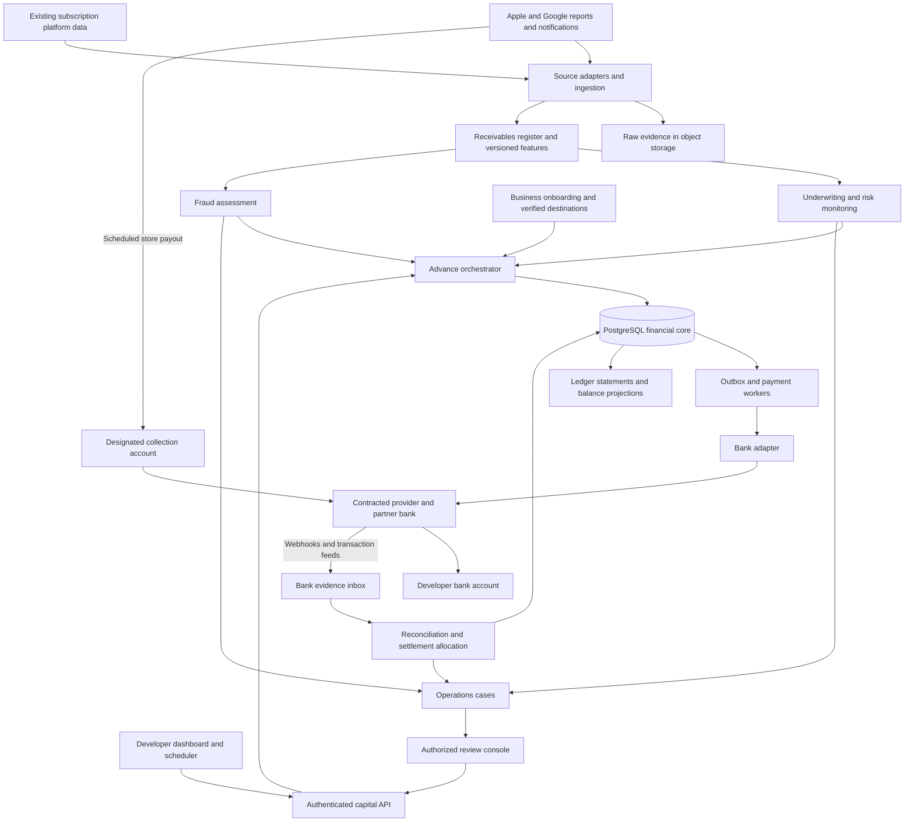
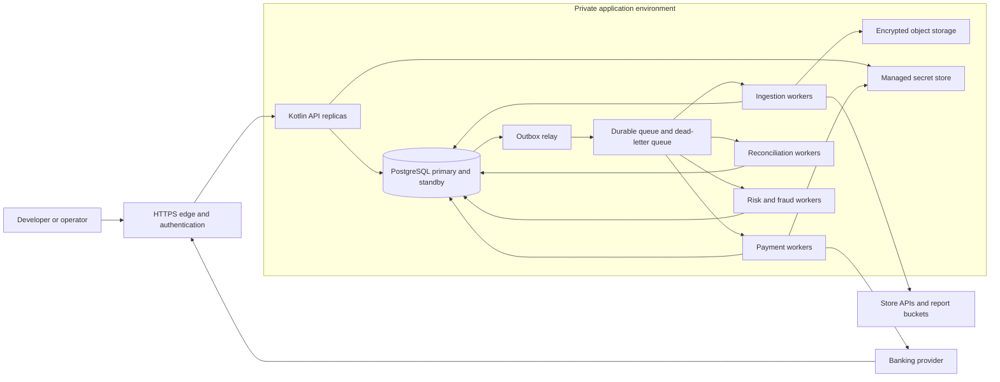
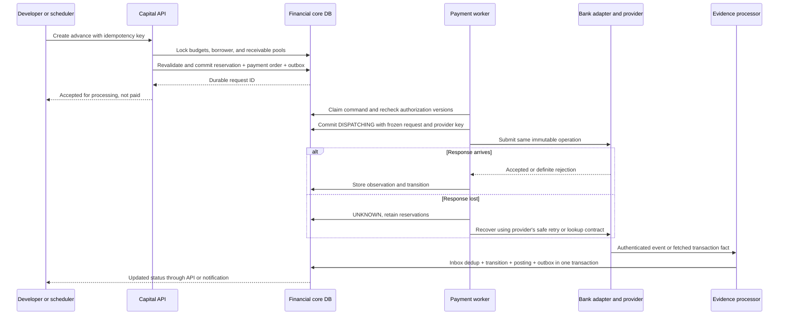

# High-level design

This is the target system. The Kotlin calculator, PostgreSQL reservation/simulated-bank recovery, and a local dashboard with illustrative monitoring, payment matching, and bounded final collection allocation are implemented. Production ingestion, banking, calibrated risk/fraud models, and complete reconciliation remain proposed. See [current implemented scope](../dashboard.md).

## System map

Solid arrows indicate calls or durable data movement. Bank rails and store payouts carry real money; events carry information about it.

Core tables include reservations, payment orders, ledger journals, bank facts, receipt allocations, and authoritative versions of risk holds. The diagram's risk/fraud arrows mean assessment inputs, not permission for those modules to update ledger balances directly.

## Deployment and ownership

API and workers share a codebase and transactional database initially. Each module owns writes to its tables through application interfaces; database privileges constrain those writes. Ledger posting and reservation transitions share one transactional boundary. Analytics uses exported/read-only projections and cannot authorize funding. Scale ingestion independently from financial writes. A cache is never the authority for available credit or cash.

| Module                | Writes it owns                                                                                    | Primary operator                                         |
| --------------------- | ------------------------------------------------------------------------------------------------- | -------------------------------------------------------- |
| Onboarding            | Legal-entity status, source connection, verified destination versions, collection-route readiness | Operations with partner-bank processes                   |
| Ingestion             | Immutable source batches and normalized revisions                                                 | Platform/backend engineering                             |
| Receivables           | Pool lifecycle, eligible estimates, settlement coverage                                           | Capital backend + finance operations                     |
| Underwriting/risk     | Policy versions, assessments, borrower limits, review cases                                       | Risk owner with engineering                              |
| Fraud                 | Signal records, decisions, scoped holds                                                           | Risk/fraud operations                                    |
| Advance orchestration | Quotes, idempotent requests, reservations, authorization versions                                 | Capital backend                                          |
| Payments              | Payment orders, attempts, normalized lifecycle                                                    | Payments engineering                                     |
| Ledger                | Accounts, balanced journals, immutable entries                                                    | Finance defines posting rules; engineering enforces them |
| Reconciliation        | Bank facts, matches, settlement allocations, breaks                                               | Finance operations                                       |

These are responsibilities, not ten separate teams or microservices.

## Main lifecycle

1. **Onboard.** Verify business eligibility and account ownership through the contracted process. Connect stores with appropriate permissions. Confirm the collection route and contractual terms. Risk approval and an active bank destination are independent gates.
2. **Ingest.** Download reports, validate notifications, preserve raw evidence, normalize revisions, and update the receivables register. A repeated monthly-to-date file replaces a versioned view; it does not create that month's earnings a second time.
3. **Assess.** Underwriting sets exposure limits and a policy; fraud evaluates available signals. Monitoring can add holds or lower limits. All outcomes record evidence versions and expiry times.
4. **Quote.** Calculate a maximum using current eligible receivables, lifetime funding against those receivables, outstanding exposure, current holds, and liquidity. Show principal, fee, and net cash separately.
5. **Reserve.** An authenticated advance request revalidates under database locks and atomically reserves credit and funding liquidity. Persist the request and outbox command before replying.
6. **Dispatch.** A worker checks for new holds and destination changes, marks the immutable operation as dispatching, commits, then calls the bank adapter with a stable idempotency key.
7. **Observe and account.** Ingest provider responses, authenticated callbacks, and bank transaction feeds. Process their effects once using durable identities. Preserve reservations while outcomes are uncertain. Convert pending exposure to funded exposure without a gap when funding is confirmed.
8. **Collect and reconcile.** Attribute the store payout using its settlement evidence and bank credit. Allocate cash to principal and developer residual according to the contract. Close the settled receivables and do not make them eligible again.
9. **Monitor and operate.** Track overdue proceeds, returns, unmatched cash, unusual activity, portfolio concentrations, and data lag. Operators investigate through audited commands.

## Advance sequence and transaction boundaries

The database transaction never spans a bank network call. The outbox closes the database-versus-queue gap, but cannot make an external transfer and a local commit atomic. The provider key and recovery workflow address that second gap. [AWS transactional outbox](https://docs.aws.amazon.com/en_en/prescriptive-guidance/latest/cloud-design-patterns/transactional-outbox.html)

## Timing and data authority

| Information                  | Authority                                                                        | Freshness approach                                             |
| ---------------------------- | -------------------------------------------------------------------------------- | -------------------------------------------------------------- |
| App purchase or refund state | Verified store data, or trusted subscription-platform projection with provenance | Notifications plus backfill/current-state checks               |
| Expected net proceeds        | Versioned report-derived receivable estimate                                     | Reporting calendar and lateness budget, not download age alone |
| Credit availability          | Committed core reservations + outstanding exposure + current policy              | Synchronous, lock-protected                                    |
| Bank cash movement           | Provider/bank posted transaction evidence                                        | Callbacks plus independent feeds and reconciliation            |
| What we owe or are owed      | Posted journals and approved allocation rules                                    | Atomic posting; reconcile external evidence                    |
| Final store settlement       | Store financial report plus the attributed bank receipt                          | Period close with adjustments and exception cases              |

Apple publishes daily reports on a next-day schedule and distinguishes estimates from final proceeds. This motivates separate source coverage, download time, and settlement status. [Apple reporting schedule](https://developer.apple.com/help/app-store-connect/reference/reporting/sales-and-trends-reports-availability), [Apple reports](https://developer.apple.com/help/app-store-connect/measure-app-performance/download-and-view-reports)

## Initial scale assumptions

Planning example, not RevenueCat traffic: 1,000 enrolled developers, 100,000 normalized source changes/day, 10,000 payout requests/day, and 10x short bursts. Daily averages hide synchronized report-arrival spikes. Load-test those bursts and lock contention before launch. Large subscription-event volume can be handled upstream; the money path needs aggregates and evidence references, not every event synchronously.

Start with one financial writer region and high-availability PostgreSQL. Evolve based on measured ingestion backlog and lock contention. Keep borrower-level funding authorization and journal atomicity together until a replacement consistency protocol has been designed and tested.
