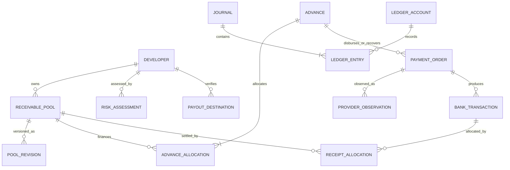

# Low-level data models and contracts

Full implementation blueprint. A smaller PostgreSQL schema, Kotlin reservation/simulator workflow, and local dashboard now exist; see [dashboard scope and actual API](../dashboard.md). The complete entities, endpoints, and module structure described here remain the target and should not be inferred from the bounded implementation.

## Module layout and the current code

```text
capital/
  onboarding/       Business eligibility, store connections, bank destinations
  ingestion/        Store and subscription-platform adapters, raw batches, revisions
  receivables/      Economic lots, estimates, period coverage, settlement runoff
  risk/             Underwriting, features, policy evaluation, scoped holds
  fraud/            Signals, assessments, review cases
  advances/         Quotes, idempotent commands, reservations, capacity authorization
  payments/         Payment state machine, attempts, dispatch and recovery
  banking/          Provider adapters and authenticated evidence ingestion
  ledger/           Posting rules, journals, entries, balances
  reconciliation/  Matching, allocations, bank/ledger controls, breaks
  operations/      Audited operator commands and case workflows
  infrastructure/  PostgreSQL transactions, inbox/outbox, queue, object/secret stores
```

Current `src/main/kotlin/capital/Eligibility.kt` maps to `risk/policy`. Its `Snapshot` is a simplified input view, not the persisted store report model. `Main.kt` is a synthetic-fixture adapter, not a bank or store adapter. Preserve the pure function behind a domain interface and add orchestration around it. Production quotes must add lifetime funding, settled-receivable runoff, borrower/portfolio limits, and source/assessment versions; do not simply put an HTTP endpoint around the current function and treat it as funding authorization.

## Main relationships



Zero or many bank transactions may correspond to an operation; a return is separate evidence. A receipt allocation can repay several advances through child principal-allocation rows. Residual payment orders refer to a developer payable obligation rather than inventing another advance.

## Proposed records and constraints

All records have stable IDs, created timestamps, and tenant/legal-entity scope where applicable. Monetary records include currency and minor-unit amounts. Store raw evidence separately with encrypted references and content hashes. Apply database-enforced tenant-scoped foreign keys so an ID from another tenant cannot be joined accidentally.

| Record | Important fields | Constraint or invariant |
| --- | --- | --- |
| `developer_control` | tenant/developer, onboarding status, risk_epoch, destination_epoch, source_epoch, row_version | One authoritative coordination row per developer |
| `source_connection` | developer, store/account ref, permissions, status, secret ref | Only active authorized sources feed eligibility |
| `source_batch` | source, logical period, source revision, hash, received_at, raw_ref | Unique revision/hash; coverage is separate from received_at |
| `economic_lot` | source transaction/aggregate identity, pool, currency, revision lineage | A receivable cannot belong to two financing pools |
| `receivable_pool` | developer/store/account/period/currency, lifecycle, latest_revision, settled_minor, funded_lifetime_minor, outstanding_minor, reserved_minor | Natural identity unique; CLOSED pools cannot originate |
| `pool_revision` | pool, revision, net_total_minor, coverage, data quality, source refs | Immutable versions; late revisions do not delete prior decisions |
| `feature_snapshot` | developer, feature/schema versions, cutoff, source watermarks, values, missingness | Reproducible point-in-time inputs |
| `risk_assessment` | limits, rate, reasons, policy/version, features, validity, reviewer | Publish only against current relevant source/risk versions |
| `fraud_assessment` | scope, action, evidence, policy/model version, expiry | Required current assessment before reserve/dispatch |
| `risk_hold` | scope, source, reason, case, active_from/until, resolution | Independent hold ownership; case resolution clears its own holds |
| `budget_control` | funding/portfolio/store scope, currency, approved amount, reserved/used, version | Locked for every consuming/releasing operation |
| `payout_destination` | owner, version, provider token, verification state, allowed purpose | Immutable referenced version; no raw credentials in payment orders |
| `quote` | max principal, fee, expires_at, versions, accepted terms | Advisory; every request is revalidated |
| `idempotency_request` | tenant, operation type, key, payload hash, operation/result ref | Unique scope/key; immutable payload binding |
| `advance` | principal, fee, net cash, status, policy and decision refs, destination version | Principal = fee + net cash under this fee model |
| `advance_allocation` | advance, pool, reserved/funded/outstanding amounts, version | Allocation sums equal parent obligation; no negative amounts |
| `payment_order` | purpose, source/destination refs, provider key, frozen payload hash, lifecycle, amount | Unique internal business intent and provider operation key |
| `dispatch_attempt` | order, attempt, lease/fence, request hash, observed result, timing | All retries reference the same frozen provider operation |
| `provider_observation` | provider/event/resource IDs, kind, event/received time, raw evidence | Immutable source facts; dedup scoped to provider/environment |
| `bank_transaction` | provider/account/transaction ID, signed amount, currency, booking date, transfer ref | Unique external cash movement; immutable corrected through new facts |
| `collection_receipt` | bank transaction, allocated/unallocated amounts, source match state | Allocations cannot exceed confirmed available receipt |
| `receipt_allocation` | receipt, pool, amount, version, source report refs | Consumes settled receivables and moves financial balances atomically |
| `principal_allocation` | receipt allocation, advance allocation, amount | Cannot repay more than current principal outstanding |
| `developer_obligation` | origin, owner, currency, payable, reserved_for_payment, paid | Residual releases cannot exceed unreserved payable |
| `ledger_account` | legal entity, developer/control scope, type, currency | Explicit ownership and currency |
| `journal` / `ledger_entry` | posting key, event refs, account, side, amount, reversal_of | Unique posting role; positive entries; equal debits/credits per currency |
| `inbox` | consumer, event identity, evidence, processing result | Unique consumer/event and atomic domain processing marker |
| `outbox` | event ID, aggregate/version, type/schema, payload, publish state | Inserted with domain commit; relay may redeliver |
| `review_case` / `reconciliation_case` | scope, evidence, assigned owner, age, disposition | Resolution through authorized commands and evidence |

Mutable balances are control projections for efficient locking and must reconcile to reservations, allocations, and journals. Only domain transactions may modify them. An immutable journal is the audit basis; immutable policy decisions are the decision basis. Do not treat an event bus as the authoritative money balance.

## Event envelope

```json
{
  "event_id": "evt_unique",
  "event_type": "AdvanceReserved",
  "schema_version": 1,
  "tenant_id": "tenant_synthetic",
  "aggregate_type": "advance",
  "aggregate_id": "advance_123",
  "aggregate_version": 1,
  "occurred_at": "2026-09-19T18:05:00Z",
  "recorded_at": "2026-09-19T18:05:00Z",
  "correlation_id": "request_123",
  "causation_id": "command_123",
  "payload": { "principal_minor": 32000, "currency": "USD" }
}
```

Event types include `SourceRevisionAccepted`, `PoolEstimateChanged`, `AssessmentPublished`, `HoldActivated`, `AdvanceReserved`, `PaymentDispatchClaimed`, `ProviderObservationReceived`, `BankTransactionObserved`, `AdvanceFunded`, `CollectionAttributed`, `PrincipalRepaid`, `ResidualPayableCreated`, `TransferReturned`, and `ReconciliationBreakOpened`.

Deliver at least once. Consumers deduplicate within their commit transaction. Aggregate versions reject stale projections or trigger reload; global event order is not assumed. Use versioned schemas, tolerable additive fields, and explicit migration paths. Raw full bank payloads and sensitive identity data stay in restricted evidence storage, not broadly subscribed messages.

## External application API

| Endpoint | Purpose | Important behavior |
| --- | --- | --- |
| `POST /v1/advance-quotes` | Get eligible principal, fee, reasons, expiry | No reservation or payment |
| `POST /v1/advances` | Request a principal amount | Idempotency required; 202 means durable processing accepted |
| `GET /v1/advances/{id}` | Read state and economic amounts | Tenant authorization; distinguish queued, unknown, paid, and returned |
| `GET /v1/statements` | Read financial statements | Derived from posted journals and attributable evidence |
| `POST /v1/payout-destinations` | Start destination verification | Step-up authorization; creates a new version |
| `POST /internal/cases/{id}/resolve` | Authorized operator action | Expected case version, reason, evidence, required approvals |
| `POST /webhooks/bank/{provider}` | Receive bank evidence | Provider authentication + durable inbox, then acknowledge |
| `POST /webhooks/stores/{source}` | Receive store notifications | Source authentication, tenant binding, durable inbox |

Example advance request, representing the calculation discussed in the session:

```http
POST /v1/advances
Idempotency-Key: client-operation-123
Content-Type: application/json

{
  "pool_id": "synthetic-pool-2",
  "quote_id": "quote_123",
  "principal_minor": 32000,
  "currency": "USD",
  "destination_version": "dest_v3",
  "terms_version": "terms_demo_v1"
}
```

Response contains the durable operation ID, principal 32000, fee 800, net cash 31200, and current processing state. A repeated identical key returns the same operation identity; callers use GET for current state. A key with a different canonical payload returns 409. Expired/changed quote terms return a requote conflict. Invalid amounts/currencies return 422. Business holds return a reason without making a payment; unexpected infrastructure errors cannot be reported as a definite bank rejection.

Persist policy rejection results when required by the idempotency contract; a later deliberate reevaluation uses a new command. An infrastructure rollback creates no successful reservation, so a retry can safely repeat the local transaction. Preserve keys at least through the complete operation/return/recovery lifecycle and the chosen audit-retention policy. Never expire an unresolved operation simply to accept another request.

Automatic payouts use a stable scheduler business key such as developer/store/currency/earnings-day/schedule-version. Retries reuse it. A deployment or recurring poll must not generate a fresh request UUID for the same intended automatic payout.

## Domain service interfaces

```text
ReceivableService.applySourceRevision(batch) -> acceptedRevision | duplicate | quarantined
UnderwritingService.assess(developer, featureSnapshot) -> assessmentId
FraudService.assess(scope, evidenceVersion) -> assessmentId
QuoteService.quote(authenticatedActor, pool, evaluatedAt) -> quote
AdvanceService.reserve(authenticatedActor, request, key) -> persistedResult
PaymentService.claimDispatch(paymentId, expectedVersion) -> frozenCommand | hold
PaymentService.recordObservation(providerObservation) -> stateChanges
LedgerService.post(postingKey, evidenceRefs, balancedEntries) -> journalId
ReconciliationService.attribute(receiptId, proposal, expectedVersions) -> allocations
CaseService.resolve(actor, caseId, expectedVersion, evidence, action) -> result
```

The transaction coordinator composes internal services sharing the same DB transaction. No external provider calls occur inside these database methods. Keep normal application reads on safe projections; use authoritative locked data for reserve, dispatch, repayment, and financial corrections.

## Numeric and temporal conventions

Use integer minor units in APIs and journals; include currency even in the USD-only phase. Do not use floating point for money or rate rounding. Percentage arithmetic uses widened intermediates; bounds and overflow failures are explicit. Rounding modes and fee-collection rules are versioned policy.

Store instants in UTC and economic dates with their source/rail timezone and calendar version. Distinguish event time, report coverage, download time, booking time, and settlement time. Reject impossible combinations; preserve legitimate out-of-order delivery. Caller-controlled clocks are suitable only for deterministic tests; production evaluation time comes from a trusted service clock.
