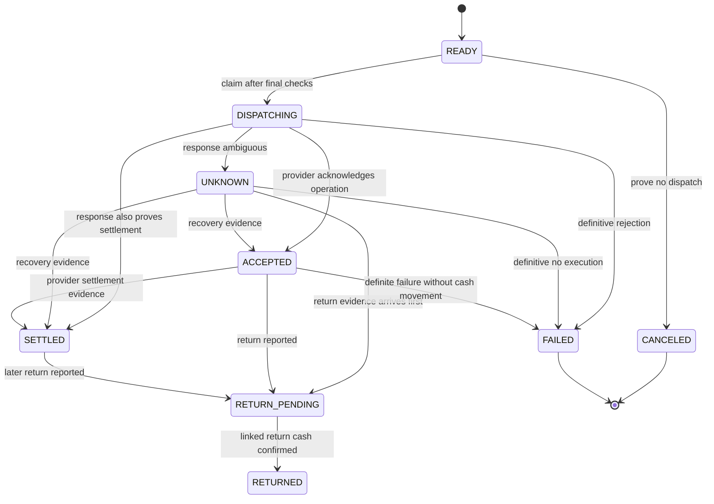
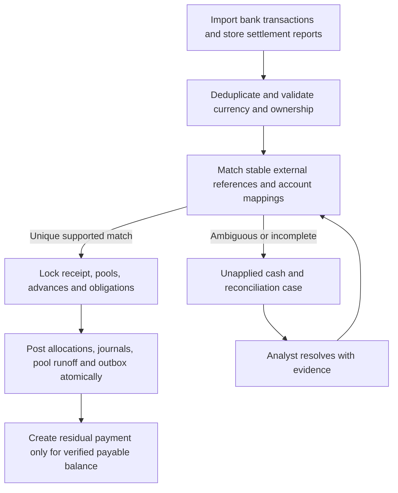

# Money movement, ledger, and reconciliation

Full reference design. The current application implements [reservations, simulated transfers, recovery, and funding journals](../transactional-payments.md). The [dashboard](../dashboard.md) adds payment reconciliation and one final receipt/report allocation per pool, including shortfalls and residual liabilities. It does not move real money or implement returns, partial/aggregated collections, residual bank payouts, or a complete collections ledger. The broader behavior below remains a specification.

## Three components with separate responsibilities

- **Advance orchestrator:** consumes approved capacity and creates one durable financial operation.
- **Payment workflow and ledger:** submit and observe bank operations; record our financial position through balanced entries.
- **Reconciliation:** compare independent records, allocate collections, and surface differences. It does not force mismatches to balance by changing history.

## Reservation transaction

`POST /advances` is a command to reserve and process, not a synchronous promise that money arrived. A request includes a principal amount, pool, accepted fee terms, destination version, and idempotency key. The server obtains developer identity from authenticated authorization, not a trusted client-supplied tenant field.

Within one PostgreSQL transaction:

1. Claim a unique `(tenant, operation_type, idempotency_key)` record. If it exists, compare a canonical request hash. Identical requests return the same operation; different payloads return a conflict.
2. Acquire affected budget rows in a global order: sorted funding/portfolio budget keys, developer control row, sorted pool IDs, then individual operation rows. Every operation that touches more than one of these follows that order.
3. Read current source/assessment watermarks, holds, destination version, policy and terms versions, pool status, exposure, lifetime funding, and available owned liquidity. Recompute capacity; a cached quote is not authorization.
4. Validate the requested principal and quote terms. If the fee or limit changed, return a requote conflict, rather than silently changing the customer's accepted economics.
5. Insert the immutable request and its per-pool allocation. Reserve principal in borrower/pool/portfolio controls and reserve the net bank debit plus the configured rail-cost allowance in treasury controls.
6. Insert a payment order with the frozen destination, amount, currency, provider, and provider idempotency key; insert `AdvanceReserved` and `SubmitPaymentRequested` in the outbox.
7. Commit, then return the operation ID and `RESERVED` status. A rollback leaves neither capacity consumed nor a dispatch command.

Use conditional updates/row locks plus uniqueness constraints. Retry deadlocks and serialization failures with the same business identity. Two simultaneous requests each for $200 against $200 capacity must yield one reservation. Requests against different pools still share the borrower and portfolio checks. PostgreSQL row locking supplies the local serialization mechanism; it does not lock the bank. [PostgreSQL locking](https://www.postgresql.org/docs/current/explicit-locking.html)

## Dispatch and reservation lifetime

A worker revalidates current holds, assessment freshness, source versions, cutoff eligibility, and frozen destination authorization before it commits `DISPATCHING`. It claims the order under the same control locks and records a dispatch attempt. It then releases DB locks and calls the provider.

When recomputing headroom for an existing reservation, exclude only that order's own reserved amounts, then validate its full principal and cash requirement against the remaining capacity. Other reservations stay included. Otherwise a valid reservation can incorrectly appear to consume the very capacity it needs. A changed limit can still invalidate it. Cancel and release a held order only if it is provably undispatched; a new approval never clears an uncertain external outcome.

An expired worker lease only permits another worker to recover the **same** operation. It does not authorize a new provider key or release exposure. Reservation expiry is allowed only for a provably undispatched order, with cancellation and release committed together. Once dispatch may have occurred, retain commitments until provider evidence establishes the outcome.

At confirmed funding, atomically subtract pending principal reservation R and add outstanding principal O and lifetime funded principal F. Do not briefly decrement R without incrementing O. On definitive pre-funding rejection, release R and unused cash reservation. On an unknown result, retain both as appropriate to observed bank debits.

## Payment state model

Keep the original settlement fact when a return arrives. `SETTLED` does not universally mean irrevocable. Record independent `accepted_at`, `bank_debit_at`, `settled_at`, and `return_at` facts rather than relying on a single increasing enum. An out-of-order return can trigger retrieval of the missing original facts; do not fabricate their timestamps or downgrade to an old `ACCEPTED` event.

## Ledger design

Use a double-entry operational subledger with immutable posted journals. Each account has legal entity, owner/developer where relevant, account purpose, and currency. Each journal has a unique business posting key and supporting source references. Every entry has a positive minor-unit amount and a debit or credit side. Post all entries, validate per-currency equality, and update balance projections atomically. Restrict direct table writes; a cross-row sum cannot be enforced by a simple per-row CHECK alone.

Proposed account families: funding cash; collection cash; advance payout in transit; developer-residual payout in transit; advance principal receivable; unapplied collections liability; developer payable; deferred advance fee; fee revenue; approved credit-loss expense/allowance; and bank-cost expense. Separate cash accounts and legal ownership. Customer residual liabilities cannot be treated as available company funding cash.

These are example operational postings, not a conclusion about RevenueCat's accounting. True-sale versus financing treatment, derecognition, contractual fees, recourse, return treatment, and revenue recognition require the actual agreement and finance policy. The illustration recognizes the deferred fee after funding confirmation under a selected example policy.

### Happy path: $1,000 proceeds, $800 principal, $20 fee

| Step and evidence                                         | Debit                                     | Credit                                                    | Operational effect                                                  |
| --------------------------------------------------------- | ----------------------------------------- | --------------------------------------------------------- | ------------------------------------------------------------------- |
| Reservation committed                                     | No posted journal                         | No posted journal                                         | Reserve $800 principal and $780 cash; reserve rail costs separately |
| Bank funding debit posted                                 | Advance payout in transit $780            | Funding cash $780                                         | Replace cash reservation with posted cash movement                  |
| Funding confirmed under provider-specific settlement rule | Advance principal receivable $800         | Advance payout in transit $780; deferred fee $20          | Move R to O and increment F by $800                                 |
| Fee earned under example finance policy                   | Deferred fee $20                          | Fee revenue $20                                           | Recognition timing is independent from cash movement                |
| Store collection cash posted                              | Collection cash $1,000                    | Unapplied collections $1,000                              | Do not allocate until settlement identity is established            |
| Store receipt and financial report matched                | Unapplied collections $1,000              | Advance principal receivable $800; developer payable $200 | Repay principal and close eligible receivables in same transaction  |
| Residual payout bank debit                                | Developer-residual payout in transit $200 | Collection cash $200                                      | Preserve developer liability until confirmed paid                   |
| Residual payout confirmed                                 | Developer payable $200                    | Developer-residual payout in transit $200                 | Close residual obligation                                           |

The developer receives $780 early plus $200 later: $980 total. The $20 fee is not charged again on collection. Our funding cash decreased by $780; collection cash retains $800 of recovered principal. An authorized internal sweep can transfer that $800 back to funding cash with its own bank operation and balanced posting. Recovered money is not available in the funding account before that sweep is confirmed or the account arrangement otherwise permits its use.

If provider debit and settlement arrive together, the posting engine can produce both journals atomically. If settlement arrives first without cash-posting evidence, preserve that fact and await/backfill the debit; keep the appropriate reservation and alert on aging. Bank fee debits get separate journals and evidence; do not hide them by changing principal or net payout.

### Returns, shortfalls, and corrections

| Situation                                                                              | Required treatment                                                                                                                                                      |
| -------------------------------------------------------------------------------------- | ----------------------------------------------------------------------------------------------------------------------------------------------------------------------- |
| Definite rejection before debit                                                        | Release reservations; no funding journal                                                                                                                                |
| Timeout with unknown bank result                                                       | Keep exposure/cash encumbrance unless a confirmed debit has already replaced the cash encumbrance; recover same operation                                               |
| Return cash before a funding asset was booked                                          | Debit funding cash and credit advance payout in transit for returned cash; release principal reservation only once outcome is established                               |
| Returned funded disbursement, before any repayments, with fee voided by example terms  | Reverse original funding/fee postings using new journals linked to originals; record return cash as a distinct fact; reduce O and voided portion of F atomically        |
| Return after repayments, residual releases, or changed fee treatment                   | Quarantine automatic reversal; compute an approved allocation against current receivable/payable balances so no already-repaid asset becomes negative                   |
| Store pays $700 against $800 outstanding and no further collectible receivable remains | Allocate $700 principal; leave $100 principal outstanding, no developer residual; open recovery/shortfall case and close that settled earnings pool for new origination |
| Store reports $1,000 but bank credits $995                                             | Open a $5 mismatch; do not invent a fee. Allocate only amounts whose source and purpose are supported; keep unresolved remainder classified                             |
| Posted accounting error                                                                | Append an approved reversal/adjustment with original journal reference; never overwrite posted entries                                                                  |

Late partial returns require amount-based remaining balances and separate linked facts, not reversal of an entire transfer by assumption. Loss write-offs are approved financial events; they must not make the original earnings eligible again. Whether a shortfall is collectible from the developer is a contract question.

## Reconciliation has three levels

1. **Payment reconciliation:** requested principal/fee/net payout ↔ provider operation ↔ actual bank debit, settlement, and returns. One transfer can produce several bank transactions.
2. **Receivables reconciliation:** normalized earnings estimate ↔ store financial report ↔ collection-account credits. A bank deposit alone may cover several apps or periods and cannot be assigned by amount alone.
3. **Ledger reconciliation:** posted bank transactions and closing account balances ↔ cash journals; advance and payable control accounts ↔ allocations and open operational balances.

Store financial reports describe proceeds; our posted bank evidence describes cash. Retain both. Increase's documentation illustrates why transfers and bank transactions are separate entities, and why ACH returns need a separate offsetting transaction. These are provider examples, not Core Bank API claims. [Transactions and transfers](https://www.increase.com/documentation/transactions-transfers), [ACH transfers](https://increase.com/documentation/sending-ach-transfers)

## Matching and allocation algorithm

Matching precedence: provider transaction/transfer IDs; verified collection-account and store settlement IDs; then a documented combination of store account, period, currency, and amounts. Amount/date similarity may suggest a candidate for an analyst but cannot by itself authorize repayment or residual release.

Support one-to-many and many-to-one allocations with explicit allocation rows. For each receipt, sum of allocations must not exceed confirmed amount. For each principal obligation, repayment must not exceed outstanding principal. Lock both sides when allocating. A duplicate settlement file or credit must not repay twice. Bank corrections create new evidence and compensating allocations.

Allocation and return handlers use the same global lock order as reservation: affected budgets, developer, sorted pools, then receipt/advance/payment rows in stable ID order. The diagram's "lock receipt" label describes the lock set, not a different acquisition order.

For partial collections, consume the corresponding economic receivable amount and repay under the contract's allocation order. Residuals stay payable until their release conditions are met; unmatched deposits remain in unapplied collections. If an ambiguous receipt might settle a pool, hold additional origination for the affected scope until attribution is resolved.

Run continuous matching plus independent daily balance/statement checks. A reconciliation case stores expected versus observed amount, currency, evidence, responsible owner, age, and disposition. Closing a case requires a balanced resolution or documented nonfinancial explanation; marking a screen "resolved" is not a ledger correction.

## Required implementation tests

Concurrent double reservation; duplicate request with different payload; worker crash before/after bank submission; callback before response; lost callback recovered from feed; duplicate cash observation through callback and statement; cancellation racing dispatch; settlement followed by return; partial collection; aggregated collection; one receipt allocated twice concurrently; settlement closing earnings eligibility; wrong currency; unknown receipt; residual payout failure/return; mismatched bank fees; and replay of every already-posted event without changing balances.
