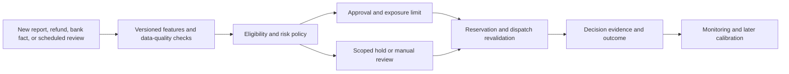

# Underwriting and continuous risk monitoring

Proposed module design. The calculator, reservation controls, and dashboard cancellation/velocity rules implement a subset. The thresholds are illustrative, not calibrated underwriting. See [implemented scope](../dashboard.md).

## What this component decides

Underwriting establishes whether a business and its receivables qualify, the permitted advance rate, maximum exposure, required reserves, and review conditions. Monitoring revisits those decisions as evidence changes. Neither component submits a bank transfer.

The risk is not simply whether an app will retain subscribers. For earned receivables, examine whether proceeds exist, are collectible through our agreed route, are already financed, can be reduced by adjustments, or may be withheld. Retention and churn can inform business stability and future origination, but do not prove the value of a specific earned receivable. Risk-bearing and recovery rights depend on the contract; do not assume a recourse loan or a true sale.

## Inputs and data quality

| Input                                                           | Use                                       | Missing-data behavior                                   |
| --------------------------------------------------------------- | ----------------------------------------- | ------------------------------------------------------- |
| Business onboarding, authorized signers, partner status         | Eligibility and identity                  | Incomplete onboarding prevents funding                  |
| Store connection and evidence of app/account control            | Provenance and access                     | Hold new funding if authority cannot be established     |
| Collection route and applicable agreement                       | Ability to receive/allocate settlement    | Hold until operationally confirmed                      |
| Historical proceeds, adjustments, refund/void patterns          | Stability and estimate uncertainty        | Insufficient history routes to manual review            |
| Final reports versus earlier estimates                          | Estimate error and loss calibration       | Use conservative policy while history develops          |
| Outstanding advances, reservations, prior settlements           | Current exposure and origination capacity | Read authoritative core state, never an analytics cache |
| Fraud assessment, payout-account changes, access anomalies      | Scoped hold or review                     | Missing/expired required assessment prevents dispatch   |
| Borrower, store, currency, partner, and funding-facility limits | Concentration and liquidity constraints   | Exceeded budget prevents new reservation                |

Keep a feature value, event-time cutoff, source coverage, ingestion time, transformation version, and quality flag. Unknown is not zero. Reports from different time zones are normalized without shifting economic periods accidentally. Store revisions supersede matching data; they do not add duplicate revenue.

## Assessment contract

```text
UnderwritingAssessment
  id, tenant_id, developer_id, assessment_version
  status: APPROVED | REVIEW_REQUIRED | DECLINED | SUSPENDED
  currency, max_total_exposure_minor, max_advance_bps
  policy_version, feature_snapshot_id, source_watermarks
  reason_codes[], required_conditions[]
  assessed_at, valid_until, reviewer_id?, supersedes_id?
```

`RiskHold` is separately keyed by scope (developer/pool/destination), source, and reason. Clearing one fraud case must not clear a data-quality or compliance hold. An approval cannot override incomplete bank onboarding. Manual overrides carry expiry, evidence, authorized reviewer, and bounded limits; they do not bypass ledger or idempotency invariants.

## Capacity calculation beyond the prototype

The prototype operates on one entirely unsettled pool. Once payments and repayments exist, one `existingExposure` subtraction is insufficient. Track these amounts for each pool and currency:

- `T`: latest cumulative net collectible proceeds estimate for the original pool, including recognized adjustments exactly once.
- `S`: store settlement proceeds already attributed to that pool; this consumes receivables even if cash is temporarily classified as developer payable or repayment.
- `U = max(0, T - S)`: remaining unsettled eligible receivables.
- `F`: lifetime principal funded against this pool, less confirmed voided disbursements. **Principal repayments do not reduce F.**
- `O`: funded principal still outstanding against the pool.
- `R`: principal reserved for accepted, dispatching, or unresolved requests, excluding principal already included in O.
- `a`: allowed advance rate, at most the product maximum.

```text
origination_headroom = max(0, floor(a * max(0, T)) - F - R)
collateral_headroom  = max(0, floor(a * U) - O - R)
pool_headroom       = min(origination_headroom, collateral_headroom)
borrower_headroom   = max(0, approved_borrower_limit - sum(O + R across pools))
candidate_principal <= min(pool_headroom, borrower_headroom, portfolio_headroom)
net_cash(candidate_principal) + reserved_rail_cost <= available_funding_liquidity
```

Validate all holds, data coverage, approval TTLs, destination version, currency, and onboarding separately. Use exact minor units and overflow-safe intermediate arithmetic. Compute the maximum allowed principal under liquidity constraints with a monotone integer calculation; do not equate gross principal and net bank debit.

For multiple pools, allocate requested principal explicitly to identified pools; do not let a developer's unrelated receivable absorb an adjustment without a documented cross-pool rule. Begin with one pool per request to keep this simple.

### Why both lifetime funding and outstanding exposure matter

For $1,000 proceeds at 80%, advance $800. If $500 is collected and used to repay principal, `T=1000, S=500, F=800, O=300, R=0`. Remaining collateral headroom is $100, but lifetime origination headroom is $0. Thus we do not advance an extra $100 against the same originally financed earnings. When the final $500 arrives, the remaining $300 principal is repaid and $200 becomes developer payable; the pool closes with no new capacity.

A new earning belongs to a new or explicitly revised economic lot, never a reset report ID. Pool identity includes developer, store account, settlement period, and currency; membership in each economic lot is unique. Corrections have revisions and lineage. A reopened accounting case does not automatically reopen financing eligibility.

## Evaluation and monitoring flow



1. Ingestion records a material-change marker and advances the relevant evidence version in the same transaction as the accepted source revision.
   Publication of eligible-pool revisions uses the same developer/pool locking discipline as funding. Raw-file persistence can happen earlier, but a new authoritative revision cannot bypass its invalidation marker.
2. A worker recalculates features and writes an immutable assessment tied to that version. Conditional publication prevents an older assessment from replacing a newer one.
3. Funding requires the assessment to cover the current required evidence watermark; a pending material change causes a temporary hold. Queue delay therefore cannot silently authorize money from a known obsolete assessment.
4. Approval or hold changes increment the developer's `risk_epoch` under the same borrower lock used by reservations and dispatch claims.
5. Periodic sweeps catch expired approvals, report gaps, delayed settlement, and missed events. Monitoring is both event-driven and scheduled.

Monitor exposure-limit utilization, estimate-to-settlement variance, refund adjustments, overdue collections by aging bucket, realized losses/recoveries, fraud cases, store/partner concentration, and data coverage. A falling limit stops new advances but cannot undo a dispatched payment; surface excess exposure and initiate a review.

## Policy first; predictive models later

Initial policy is transparent rules with a documented reason for each hold or haircut. Do not present toy thresholds as validated credit policy. To add a model:

1. Define the target, such as net settlement shortfall within an agreed horizon after expected payout, and what counts as loss after recoveries.
2. Build point-in-time datasets using only information available at the original decision. Keep later reports, refunds, and outcomes out of earlier features.
3. Use temporal validation and grouped developer splits; account for label delay and the fact that rejected applicants have unobserved funding outcomes.
4. Evaluate calibration, expected loss, exposure-weighted loss, approval coverage, review workload, and stability across segments. Business acceptance criteria belong to the risk owner.
5. Run shadow decisions, then a bounded exposure rollout with rollback and champion/challenger comparison. Record model and feature versions with every decision.

PD × LGD × EAD is an optional modelling decomposition, not a source of probabilities. Historical data and a well-defined loss event are needed before those terms become useful estimates.

## Acceptance scenarios for implementation

Normal approval; insufficient history; stale coverage with fresh download; late adjustment causing excess exposure; simultaneous requests sharing borrower limits across two pools; limit reduction during queued dispatch; an old approval arriving after a hold; partial settlement that must not recycle capacity; close/reopen/revision of a pool; independent holds cleared separately; and a model outage falling back only to an explicitly approved conservative rule policy.
