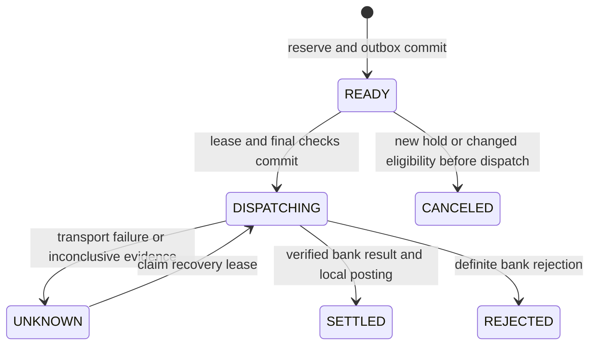

# Transactional reservations and simulated bank recovery

This slice implements PostgreSQL-backed reservations, a durable dispatch outbox, independently committed simulated-bank payments over loopback HTTP, recovery, and a minimal funding journal. It uses synthetic USD money only. It does not connect to a real bank or move real funds.

## User decision

When an uncertain payment coincides with a new risk hold, the user chose: **query only during the hold, keep the reservation**.

That means:

- Bank confirms it already paid: record the payment and replace reserved exposure with funded exposure, even though the hold remains active.
- Bank confirms rejection: release the reservation.
- Bank cannot establish the result, or lookup says not found: retain principal and cash reservations. Do not submit again while held.
- With no hold and still-valid eligibility, recovery may retry the same frozen operation and bank key. A not-found lookup never justifies releasing capacity or inventing a new key.
- A hold committed after a dispatch authorization cannot reliably stop an already-sent operation. The tests distinguish that race from a hold that exists before a recovery resubmission.

## Implemented boundaries

| Component                                                                              | Implementation                                                                                                                                 |
| -------------------------------------------------------------------------------------- | ---------------------------------------------------------------------------------------------------------------------------------------------- |
| [AdvanceService](../src/main/kotlin/capital/payments/AdvanceService.kt)                | Atomically reserves borrower/pool capacity and cash, writes the advance and outbox, revalidates before dispatch, and recovers unknown outcomes |
| [Database](../src/main/kotlin/capital/payments/Database.kt)                            | Independent JDBC connections and explicit PostgreSQL transactions; no JVM mutex supplies correctness                                           |
| [Capital schema](../src/main/resources/db/capital.sql)                                 | Unique request/provider keys, monetary checks, frozen payment commands, append-only balanced funding journals                                  |
| [HTTP bank adapter](../src/main/kotlin/capital/payments/BankGateway.kt)                | Sends immutable commands and validates matching evidence; bounds the full response, including body consumption                                 |
| [Fake bank](../src/main/kotlin/capital/payments/FakeBankServer.kt)                     | Separate schema and transactions; executes once per key and debits a synthetic balance; can truncate a response after committing               |
| [Integration tests](../src/test/kotlin/capital/payments/ReservationIntegrationTest.kt) | Real PostgreSQL in Docker, concurrent clients, actual HTTP faults, separate-JVM crash, hold policy, ledger constraints, and recovery           |

The app and fake bank share a PostgreSQL server for convenience, but use separate schemas and connection transactions. App rollback cannot undo the bank's committed transfer. This is failure-boundary isolation, not a claim of production security isolation between database principals.

## State and transaction boundaries



Each reservation transaction locks treasury, developer, pool, then the operation where needed. Global treasury locking is intentionally simple and serializes this small demo's funding authorization. A production system would need measured contention and carefully allocated budget partitions before relaxing this boundary.

The bank call happens after the dispatch claim commits. The operation's generation fences older workers from overwriting newer observations. A lease expiring does not release capacity. Recovery of a claimed/unknown operation starts with a lookup, followed by a new eligibility/hold check before any allowed resubmission.

When checking an existing reservation, subtract its own principal from reserved totals before evaluating whether it still fits; retain every other reservation. Lifetime funding prevents principal repayments from creating new origination capacity against the same earnings. Settlement processing itself is not implemented; the partial-repayment scenario seeds an already-adjusted snapshot to test that limit.

After the fake bank confirms settlement, one local transaction:

1. Releases the cash reservation and deducts the confirmed bank debit from the cash control balance.
2. Moves principal from reserved to outstanding and increments lifetime funding against the pool.
3. Posts a balanced journal: debit advance receivable for principal; credit funding cash for net cash and deferred fee for the fee.
4. Marks the advance settled and the outbox intent complete.

A failure anywhere in that transaction rolls back all four steps. The bank effect remains and is recovered through the same operation.

## The failure scenario

With $1,000 in proceeds, $600 already advanced, and $1,000 synthetic funding cash:

| Step                                             | Local state | Reserved principal | Reserved cash | Bank transfers | New funding journals |
| ------------------------------------------------ | ----------- | -----------------: | ------------: | -------------: | -------------------: |
| Reserve another $200 principal                   | READY       |               $200 |          $195 |              0 |                    0 |
| Bank pays $195, then truncates HTTP response     | UNKNOWN     |               $200 |          $195 |              1 |                    0 |
| New risk hold; query finds the existing transfer | SETTLED     |                 $0 |            $0 |              1 |                    1 |
| Replay the already-completed operation           | SETTLED     |                 $0 |            $0 |              1 |                    1 |

The bank and local cash controls then show $805. Total outstanding principal is $800. The new journal has $200 debit and $195 + $5 credits. Fee recognition beyond deferral is outside this slice.

The existing $600 advance and opening cash are seed fixture balances, not a full opening-balance journal set. The minimal journal covers newly simulated funding only; this is not a complete reconciled general ledger.

## Running it

JDK 17 and Docker are required for the integration suite. Docker is not required for the original calculator tests.

```sh
./gradlew test                 # original calculator tests
./gradlew integrationTest      # PostgreSQL + HTTP bank integration tests
./gradlew check                # both suites
```

For a persistent, inspectable demo:

```sh
docker compose up -d --wait postgres
./gradlew paymentDemo
docker compose stop postgres
```

The demo writes `build/payment-demo.json`. It creates fresh uniquely named capital and bank schemas on each run and preserves earlier data; it does not reset an existing database. Compose binds PostgreSQL to loopback port 55432 with explicitly local demo credentials. `LAB_JDBC_URL`, `LAB_DB_USER`, and `LAB_DB_PASSWORD` can select a different local demo database. Never point this prototype at a production database.

Add `--gradle-user-home .gradle-user-home` to reuse the project-local Gradle cache used during this session. The integration suite manages and removes its own temporary PostgreSQL container. It does not silently skip database tests if Docker is unavailable.

## Defect found during fault testing

The first integration run stalled waiting for the body of the intentionally truncated response. A thread dump located the wait inside `HttpClient.send`, despite the configured request timeout. The adapter was changed to use an asynchronous response future with a deadline covering full body completion, canceling the request on failure. An outer test deadline now guards the scenario as well.

This was an actual implementation defect found by the agent during testing. It must not be described as a defect the user personally discovered. It is distinct from the earlier deliberate freshness mutation used to check test sensitivity.

## Still outside this slice

Real bank authentication and provider contracts; complete onboarding or fraud models; source-calendar adapters; persisted risk-assessment TTLs and policy rollouts; a public authenticated API; an external message broker; returns and collections; settlement allocation and residual payouts; bank fees and multiple currencies; opening-balance accounting; production retry/backoff and operations queues; production database roles and a versioned migration framework.

The outbox is a durable database-polled intent, not a claim of exactly-once network delivery. The simulator intentionally combines execution and settlement. A real provider may accept first, debit later, settle later still, and subsequently return a transfer; the broader architecture specifies those separate facts.
